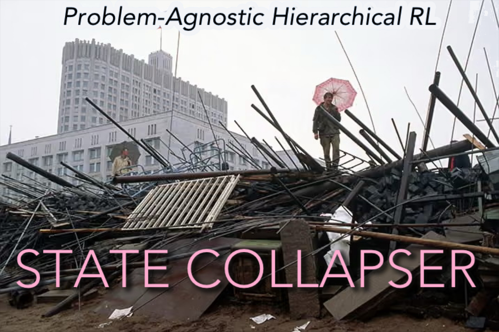

<picture>
  
</picture>

<p align="center">
  <a href="https://github.com/TYLERSFOSTER/state_collapser/actions/workflows/ci.yml">
    
  </a>
  <!-- <a href="https://pypi.org/project/state-collapser/">
    
  </a> -->
  
  <a href="https://github.com/TYLERSFOSTER/state_collapser/releases">
    
  </a>
  <!-- <a href="https://github.com/TYLERSFOSTER/state_collapser/issues">
    
  </a> -->
  <a href="./LICENSE">
    
  </a>
  <a href="https://github.com/astral-sh/ruff">
    
  </a>
</p>

`state_collapser` is a Python package for inducing hierarchical reinforcement-learning structure on RL problems that do not arrive with an obvious subtask decomposition or a natural human-readable hierarchy.

***<ins>WHAT</ins>:*** Not assuming that any hierarchy be visible in the problem specification, the package constructs quotient-style tower structure by recursively contracting discovered state/action graph structure. The result is a research-oriented runtime layer for experimenting with coarse-to-fine control, quotient tiers, and abstract intermediate states that need not be directly executable as long as they admit lift back to executable behavior.

***<ins>WHY</ins>:*** The expected payoff is a reduction in effective search and training burden. Rather than repeatedly learning over the full fine-scale path space, the agent can learn first over more collapsed quotient structure, then return to finer tiers only for the additional correction that the coarser tiers could not supply. In the best case, this replaces broad flat exploration with staged coarse-to-fine control over a much smaller effective path space.

***<ins>WHERE</ins>**:*
For an engineer used to existing RL tooling, `state_collapser` sits near
frameworks such as RLlib and Stable-Baselines3, but it is not trying to be either. `state_collapser` is a structural layer that can sit before or
beside a learner:
```text
Gymnasium env
    -> state_collapser discovers graph/tower/quotient structure
        -> policy learner trains using tower-aware decision inputs
```
The same quotient/tower layer can also support non-RL graph dataflow. The first
downstream application is
[`HGraphML`](https://github.com/TYLERSFOSTER/HGraphML), which treats a known
graph as already discovered, builds a `state_collapser` partition tower around
it, runs message passing on a coarse tier, and lifts messages back over node and
edge fibers.

***<ins>HOW</ins>**:*
If the underlying mathematical model and its log speed-up theorems will best justify this `state_collapser` package for you, I'd start with [this companion research paper](./docs/design/logHRL.pdf) that explains why such a package should exist in the first place. If benchmarks demonstrating the speed-up in coordination-constrained RL problems will best justify this `state_collapser` package for you, I'd start with [this evaluation document](./EVALUATION.md).

## Installation

Python `3.11` or `3.12` is required for the current release line.

The current public-release target is a lightweight GitHub research release.
PyPI publication is intentionally deferred until the serious benchmark track is
complete, so install from source for now.

Install from a local checkout:

```bash
pip install -e .
```

Install from a public GitHub tag once the repository is public:

```bash
pip install "state-collapser @ git+https://github.com/TYLERSFOSTER/state_collapser.git@v0.7.0"
```

Install a local checkout with development tooling:

```bash
pip install -e ".[dev]"
```

Install a local checkout with the current RL and ML extras:

```bash
pip install -e ".[dev,rl,ml]"
```

## Quick Start

The top-level package surface is intentionally small right now:

```python
import state_collapser

print(state_collapser.__version__)
```

Most current entry points live in explicit subpackages.

### Run the existing tower-aware `PlateSupportEnv` example

```python
from state_collapser.examples.plate_support_env import (
    PlateSupportEnv,
    TowerTrainingConfig,
    run_tower_training,
)

result = run_tower_training(
    env=PlateSupportEnv(),
    config=TowerTrainingConfig(
        episodes=20,
        max_steps_per_episode=50,
        alpha=0.5,
        gamma=0.95,
        epsilon=0.2,
        seed=0,
    ),
)

print("episodes:", len(result.episodes))
print("successes:", sum(1 for ep in result.episodes if ep.success))
```

### Run the migrated `rl_counterpoint_v3` example

```python
from state_collapser.examples.rl_counterpoint_v3 import (
    RlCounterpointEnv,
    TowerTrainingConfig,
    run_tower_training,
)

result = run_tower_training(
    env=RlCounterpointEnv(),
    config=TowerTrainingConfig(
        episodes=5,
        max_steps_per_episode=16,
        alpha=0.5,
        gamma=0.95,
        epsilon=0.2,
        seed=0,
    ),
)

print("episodes:", len(result.episodes))
print("q_table_states:", len(result.q_table))
print("successes:", sum(1 for ep in result.episodes if ep.success))
```

### Run the newer exploit/explore control path on the same RL problem

```python
from state_collapser.examples.plate_support_env import (
    ExploitExploreTrainingConfig,
    PlateSupportEnv,
    run_exploit_explore_training,
)

result = run_exploit_explore_training(
    env=PlateSupportEnv(),
    config=ExploitExploreTrainingConfig(
        episodes=10,
        max_control_steps_per_episode=20,
        alpha=0.5,
        gamma=0.95,
        seed=0,
    ),
)

print("episodes:", len(result.episodes))
print("successes:", sum(1 for ep in result.episodes if ep.success))
```

### Probe tower depth across example environments

```bash
.venv/bin/python -m state_collapser.examples.tower_depth_probe plate_support_env rl_counterpoint_v3 --schema-mode default
```

To compare against an explicit flat partition baseline:

```bash
.venv/bin/python -m state_collapser.examples.tower_depth_probe plate_support_env rl_counterpoint_v3 --schema-mode none
```

This utility is useful when you want to inspect:

- how deep the dynamically constructed tower gets
- whether deeper tiers are materializing in a given example
- whether schema-driven partition contraction is scheduling discovered edges
- whether a change in contraction/runtime behavior materially changes tower growth

In the current partition-backed runtime, `ContractionSchema` is the tower
contraction schedule. `ContractionPolicy` remains available for legacy,
local-star, and vista-facing compatibility, but it is not the source of
partition-tower coarsening. Example environments that exercise hierarchy provide
default smoke schemas; pass `NoContractionSchema()` in Python, or
`--schema-mode none` in the probe, when you want an explicit flat baseline.

## Core Features

- Hidden, explored, and vista graph layers for RL state/action structure.
- Persistent nested state/action partition towers with quotient-tier compatibility readouts.
- Full-graph partition-tower construction usable by downstream graph-dataflow
  packages such as HGraphML.
- Tower runtime snapshots and tower-aware training support.
- An initial internal `state_collapser.training` package with reusable training-facing surfaces.
- A first tensorization boundary for backend-independent linearization,
  benchmark-mode reporting, and optional Torch batch conversion.
- A first exploit/explore active-tier controller.
- Example environments and runnable example training paths.
- Strong design-document support for the mathematical and architectural model.

## Why This Package Exists

Many HRL methods work best when an RL problem already comes with meaningful subtasks, a clean parameter reduction, or an obvious hierarchical task decomposition. But many important RL problems, such as constrained robotics and coordinated control problems, do not present themselves in that way.

In such settings, the reachable state/action structure may live on a constrained subset of a larger ambient space, and the natural coarse structure may be hidden rather than explicit. `state_collapser` is aimed at this harder case. It is capable of inducing a hierarchical learning structure on problems with no canonical such structure.

The package is built around two core ideas:

- Hierarchy can be induced by recursive contractions of discovered state/action graph structure.
- Intermediate HRL states can be pure abstractions, provided they admit a lift back to executable behavior.

## Current Implemented Surface

The package currently contains real code for:

- `state_collapser.core`
  - states, actions, edges, rewards, labels, and annotations
- `state_collapser.graph`
  - hidden graphs, explored graphs, vista graphs, and local-star structure
- `state_collapser.contract`
  - contraction-policy and selection surfaces
- `state_collapser.quotient`
  - projections, cosets, and tier views
- `state_collapser.tower`
  - schema-driven partition-backed tower runtime, `LiveRuntimeView`, serializable `RuntimeSnapshot`, lazy compatibility readouts, trustworthiness, and exploit/explore control
- `state_collapser.training`
  - internal reusable decision inputs, action masks, continuation-aware
    transitions, collectors, learners, metrics, reference loops,
    fiber-conditioned training surfaces, backend-independent linearization,
    `EncodingRegistry`, `LinearizationConfig`, `LinearizationReport`, and
    optional Torch batch conversion under `state_collapser.training.torch`
- `state_collapser.adapters`
  - `StateCollapserGymWrapper` hook surfaces and legacy/toy adapter examples
- `state_collapser.benchmarks`
  - lightweight runtime benchmark smoke tooling for hot-path/readout comparisons
- `state_collapser.examples`
  - reference example environments and runtime integrations

The most developed example packages right now are:

- `state_collapser.examples.plate_support_env`
- `state_collapser.examples.rl_counterpoint_v3`

The example suite also now includes:

- `state_collapser.examples.articulated_loop_env`
- `state_collapser.examples.cable_parallel_env`
- `state_collapser.examples.dual_arm_manipulation_env`
- `state_collapser.examples.parallelogram_singularity_env`

The current evaluation examples expose default contraction schemas for the
partition-backed runtime, plus explicit flat-baseline behavior through
`NoContractionSchema`.

`plate_support_env` still contains:

- the environment
- a runtime adapter
- the older tower-aware training path
- the newer exploit/explore training path

`rl_counterpoint_v3` now serves as the first real migration target for the new training-surface package:

- the environment
- a runtime adapter
- a tower-aware training path built on the new reusable training components

## Repository Status

This project is `pre-alpha`.

What is solid enough to rely on:

- the package layout
- CI, linting, typing, and test workflow
- the first vertical slice of graph / quotient / tower runtime machinery
- the example environment integrations
- the existence of both old and new training paths for `PlateSupportEnv`
- the first internal `state_collapser.training` component layer
- the first `FrozenQuotientBehavior -> PathFiber -> FiberConditionedStage` bridge
- the first tensorization boundary for linearized training records and optional
  Torch batches
- the migrated `rl_counterpoint_v3` training path as a first training-surface reality check

What should still be treated as unstable:

- the broad public API
- the public shape of `state_collapser.training`
- the public shape of tensorization and Torch batch-conversion surfaces
- exploit/explore control tuning and behavior
- long-term naming of some modules and surfaces
- future instrumentation and benchmark interfaces

## Project Structure

Current top-level source layout:

```text
src/state_collapser/
  core/
  graph/
  contract/
  quotient/
  tower/
  training/
  adapters/
  benchmarks/
  examples/
  instrumentation/
```

The instrumentation area is intended to support future work on:

- path-space metrics
- tower-growth metrics
- training-run visualization

## Documentation

Where to go next:

- New to the package: start with [`docs/usage/01_001_what_state_collapser_is.md`](./docs/usage/01_001_what_state_collapser_is.md).
- Trying to understand the tower runtime: read [`docs/usage/01_002_tower_runtime_mental_model.md`](./docs/usage/01_002_tower_runtime_mental_model.md).
- Trying to train with your own learner: read [`docs/usage/01_003_training_surface_quickstart.md`](./docs/usage/01_003_training_surface_quickstart.md) and [`docs/usage/01_004_fiber_conditioned_training.md`](./docs/usage/01_004_fiber_conditioned_training.md).
- Adding a tensor/model boundary: read [`docs/usage/01_010_tensorization_boundary.md`](./docs/usage/01_010_tensorization_boundary.md).
- Looking for exact implemented surfaces: use [`docs/api_notes`](./docs/api_notes).
- Looking for downstream applications: read [`docs/usage/01_009_downstream_applications.md`](./docs/usage/01_009_downstream_applications.md).
- Planning to contribute: read [`CONTRIBUTING.md`](./CONTRIBUTING.md).
- Looking for vulnerability/reporting expectations: read [`SECURITY.md`](./SECURITY.md).

General package docs:

- [`docs/usage`](./docs/usage)
- [`docs/api_notes`](./docs/api_notes)
- [`docs/package_usage.md`](./docs/package_usage.md)
- [`docs/public_api.md`](./docs/public_api.md)
- [`CONTRIBUTING.md`](./CONTRIBUTING.md)

Mathematical and design docs:

- [`docs/design/logHRL.pdf`](./docs/design/logHRL.pdf)
- [`docs/design/log_tropical_geometry/01_001_log_tropical_geometry_and_quotient_tower_discussion.md`](./docs/design/log_tropical_geometry/01_001_log_tropical_geometry_and_quotient_tower_discussion.md)
- [`docs/design/reward_locality_for_quotient_training.md`](./docs/design/reward_locality_for_quotient_training.md)
- [`docs/design/module_design_desiderata.md`](./docs/design/module_design_desiderata.md)
- [`docs/design/package_best_practices_proposal.md`](./docs/design/package_best_practices_proposal.md)
- [`docs/design/model_train_surfaces/01_001_model_and_training_surface_architecture.md`](./docs/design/model_train_surfaces/01_001_model_and_training_surface_architecture.md)
- [`docs/design/model_train_surfaces/01_002_model_and_training_surface_blueprint.md`](./docs/design/model_train_surfaces/01_002_model_and_training_surface_blueprint.md)
- [`docs/design/model_train_surfaces/01_005_big_boy_benchmarking_tensorization_alignment_note.md`](./docs/design/model_train_surfaces/01_005_big_boy_benchmarking_tensorization_alignment_note.md)
- [`docs/design/RL_framework_maturity/01_001_rl_framework_maturity_and_tower_training_spine_discussion.md`](./docs/design/RL_framework_maturity/01_001_rl_framework_maturity_and_tower_training_spine_discussion.md)
- [`docs/design/RL_framework_maturity/01_002_fiber_conditioned_training_spine_blueprint.md`](./docs/design/RL_framework_maturity/01_002_fiber_conditioned_training_spine_blueprint.md)
- [`docs/design/Young_tableaux_refactor/01_001_young_tableaux_runtime_refactor_blueprint.md`](./docs/design/Young_tableaux_refactor/01_001_young_tableaux_runtime_refactor_blueprint.md)
- [`docs/design/tensorization`](./docs/design/tensorization)

Major implementation docs:

- [`docs/design/final_initial/final_initial_blueprint.md`](./docs/design/final_initial/final_initial_blueprint.md)
- [`docs/design/final_initial/final_initial_implementation_gameplan.md`](./docs/design/final_initial/final_initial_implementation_gameplan.md)
- [`docs/design/HRL_exploit-explore/01_013_exploit_explore_algorithm_blueprint.md`](./docs/design/HRL_exploit-explore/01_013_exploit_explore_algorithm_blueprint.md)
- [`docs/design/HRL_exploit-explore/01_014_exploit_explore_algorithm_implementation_gameplan.md`](./docs/design/HRL_exploit-explore/01_014_exploit_explore_algorithm_implementation_gameplan.md)
- [`docs/design/model_train_surfaces/01_003_model_and_training_surface_implementation_gameplan.md`](./docs/design/model_train_surfaces/01_003_model_and_training_surface_implementation_gameplan.md)
- [`docs/design/Young_tableaux_refactor/01_002_young_tableaux_runtime_refactor_implementation_gameplan.md`](./docs/design/Young_tableaux_refactor/01_002_young_tableaux_runtime_refactor_implementation_gameplan.md)
- [`docs/design/Young_tableaux_refactor/01_003_young_tableaux_runtime_refactor_implementation_log.md`](./docs/design/Young_tableaux_refactor/01_003_young_tableaux_runtime_refactor_implementation_log.md)
- [`docs/design/test_design/post_young_audit/01_003_post_young_diagram_evaluation_environment_repair_implementation_gameplan.md`](./docs/design/test_design/post_young_audit/01_003_post_young_diagram_evaluation_environment_repair_implementation_gameplan.md)
- [`docs/design/RL_framework_maturity/01_006_fiber_conditioned_training_spine_paired_implementation_log.md`](./docs/design/RL_framework_maturity/01_006_fiber_conditioned_training_spine_paired_implementation_log.md)
- [`docs/design/tensorization/01_003_tensorization_implementation_gameplan.md`](./docs/design/tensorization/01_003_tensorization_implementation_gameplan.md)
- [`docs/design/tensorization/01_004_tensorization_implementation_log.md`](./docs/design/tensorization/01_004_tensorization_implementation_log.md)
- [`docs/design/tensorization/01_005_hgraphml_tensorization_followup_bridge.md`](./docs/design/tensorization/01_005_hgraphml_tensorization_followup_bridge.md)

Continuity / project history:

- [`docs/engineer_continuity/2026/05/15/01_007_exploit_explore_design_implementation_and_merge.md`](./docs/engineer_continuity/2026/05/15/01_007_exploit_explore_design_implementation_and_merge.md)
- [`docs/engineer_continuity/2026/05/20/01_009_evaluation_family_counterpoint_and_training_surface_consolidation.md`](./docs/engineer_continuity/2026/05/20/01_009_evaluation_family_counterpoint_and_training_surface_consolidation.md)
- [`docs/engineer_continuity/2026/05/23/01_010_package_readiness_and_loghrl_research_document_consolidation.md`](./docs/engineer_continuity/2026/05/23/01_010_package_readiness_and_loghrl_research_document_consolidation.md)
- [`docs/engineer_continuity/2026/05/24/01_011_young_tableaux_runtime_review_release_and_synthetic_blow_revisions.md`](./docs/engineer_continuity/2026/05/24/01_011_young_tableaux_runtime_review_release_and_synthetic_blow_revisions.md)
- [`docs/engineer_continuity/2026/05/25/01_012_state_collapser_rl_spine_public_release_hgraphml_and_history_rewrite.md`](./docs/engineer_continuity/2026/05/25/01_012_state_collapser_rl_spine_public_release_hgraphml_and_history_rewrite.md)
- [`docs/engineer_continuity/2026/05/29/01_013_log_tropical_tensorization_and_hgraphml_followup.md`](./docs/engineer_continuity/2026/05/29/01_013_log_tropical_tensorization_and_hgraphml_followup.md)

## Development

Common local checks:

```bash
.venv/bin/python -m pytest tests
.venv/bin/python -m ruff check .
.venv/bin/python -m mypy src
```

The project expects:

- typed Python
- tests for new runtime behavior
- alignment with the authoritative design documents
- care with the package’s mathematical vocabulary

## Evaluation

Evaluation and benchmarking guidance: [`EVALUATION.md`](./EVALUATION.md)

## License

This project is released under the [MIT License](./LICENSE).
