# state_collapser System Flowcharts And Control Flow

Date: 2026-05-30

Status: repo-crawl architecture/control-flow map

## Purpose

This document is a Mermaid-heavy map of how the current `state_collapser`
package works in code. It is grounded in the package source as of the v0.7-era
runtime, after the Young-diagram/partition-tower refactor and tensorization
boundary work.

The main point:

```text
state_collapser is not an RL algorithm runner.
state_collapser is a structural runtime layer around a discovered transition graph.
```

The package discovers or receives graph structure, maintains a nested
state/action partition tower over the discovered base graph, exposes snapshots
and tower-aware decision inputs, and optionally converts those semantic objects
into numeric records or Torch batches at learner/benchmark boundaries.

## Source Files Used For This Crawl

Primary source files:

- `src/state_collapser/core/*`
- `src/state_collapser/graph/*`
- `src/state_collapser/tower/runtime.py`
- `src/state_collapser/tower/snapshot.py`
- `src/state_collapser/tower/partition/*`
- `src/state_collapser/tower/control/*`
- `src/state_collapser/training/*`
- `src/state_collapser/adapters/gymnasium.py`
- `src/state_collapser/examples/*/{env,runtime,training}.py`
- `src/state_collapser/benchmarks/tower_runtime_bench.py`

Design/usage context:

- `README.md`
- `docs/usage/01_010_tensorization_boundary.md`
- `docs/design/tensorization/*`
- `docs/design/Young_tableaux_refactor/*`
- `docs/design/RL_framework_maturity/*`

## Whole Package Layer Map

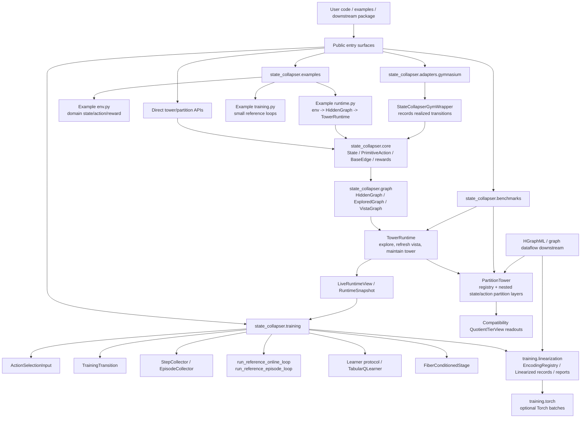

## Conceptual Ownership Map

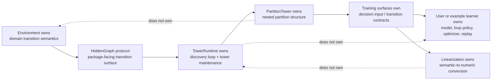

## Core Runtime Control Flow

`TowerRuntime` is the main object-native runtime coordinator. It binds:

- a `HiddenGraph`;
- an `ExploredGraph`;
- a `VistaGraph`;
- optional local-star `ContractionPolicy` annotation behavior;
- a partition-tower `ContractionSchema`;
- a `PartitionTower`;
- and snapshot production.

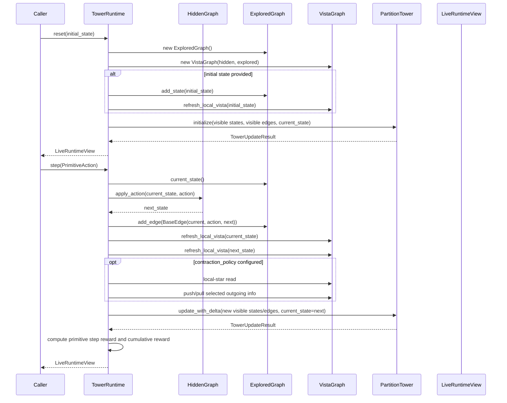

## Runtime Step Flowchart

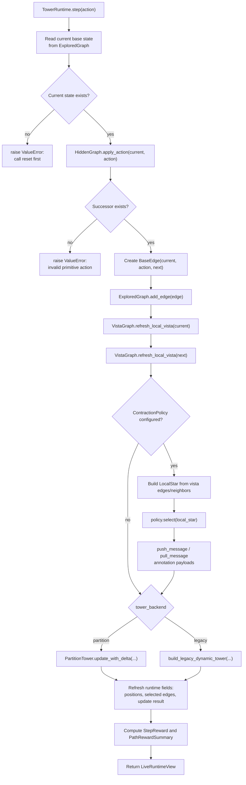

## Hidden / Explored / Vista Graph Roles

```mermaid
flowchart LR
    Hidden["HiddenGraph<br/>complete environment transition oracle"] -->|apply_action| Runtime["TowerRuntime"]
    Hidden -->|out_edges(state)| Vista["VistaGraph<br/>one-hop visible fringe"]
    Runtime --> Explored["ExploredGraph<br/>visited states, edges, path"]
    Runtime --> Vista
    Vista -->|vista_edges / vista_neighbors| Runtime
    Vista -->|node_payload annotations| Runtime

    Explored -->|visited_states / visited_edges| Visible["Visible base graph"]
    Vista -->|cached outgoing edges for visited states| Visible
    Visible --> PartitionTower["PartitionTower registry + layers"]
```

## Partition Tower Data Model

The partition tower is the runtime form of the paper's nested state/action
coset system. The important implementation choice is that the base graph is not
copied into quotient graphs at every tier. Instead:

- `BaseGraphRegistry` stores stable ids for base states, edges, and actions;
- each `StatePartitionLayer` stores one partition of state ids at one tier;
- each `ActionPartitionLayer` stores outgoing-action collections and action
  cells aligned with the state cells at that tier;
- `ContractionSchema` assigns base edges to ordered contraction blocks;
- `TowerUpdateResult` records deltas, merges, internal edges, diagnostics, and
  optional morphism data.

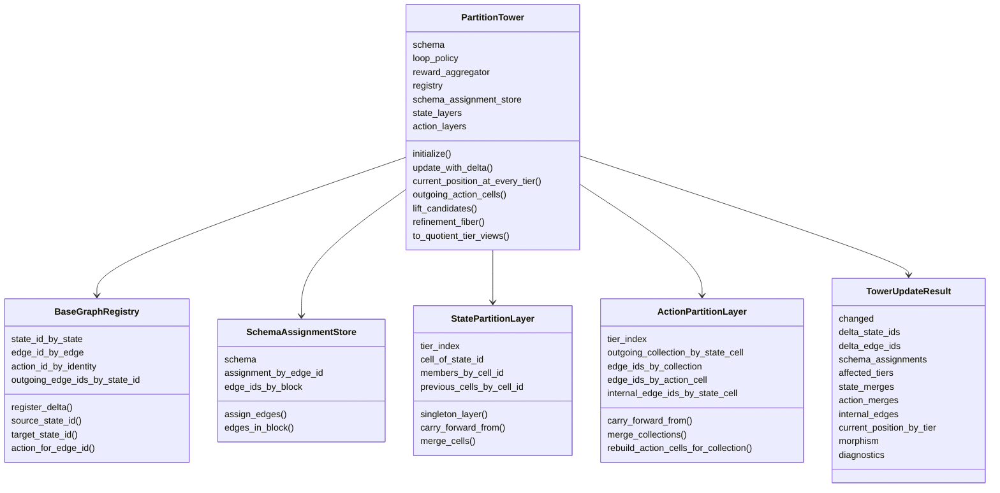

## Partition Tower Full Build

Full build is used by `PartitionTower.initialize(...)` and by
`build_partition_tower_full(...)` when a caller already has discovered graph
data.

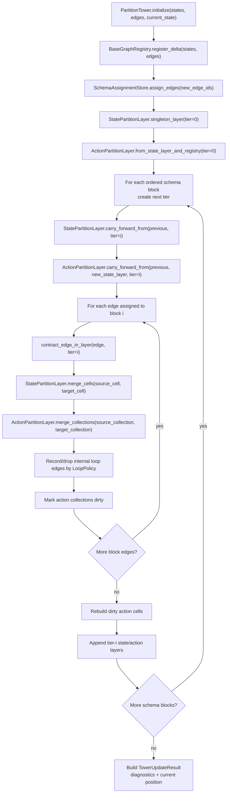

## Partition Tower Incremental Update

Incremental update is the hot-path version used after exploration. The runtime
passes only newly visible local graph data into `update_with_delta`.

```mermaid
flowchart TD
    Start["PartitionTower.update_with_delta(delta_states, delta_edges)"] --> MaybeMorphism{"build_morphism?"}
    MaybeMorphism -- yes --> Capture["Capture old active cell domain"]
    MaybeMorphism -- no --> Register
    Capture --> Register["BaseGraphRegistry.register_delta(...)"]

    Register --> Assign["Assign only new edge ids to schema blocks"]
    Assign --> NewStates["Add new states as singleton cells to existing layers"]
    NewStates --> InsertEdges["Insert new edges into existing action collections"]
    InsertEdges --> Internal0{"Edge internal in a tier?"}
    Internal0 -- yes --> RecordInternal["Record internal edge by loop policy"]
    Internal0 -- no --> DirtyCollection["Mark source outgoing collection dirty"]

    RecordInternal --> Scheduled
    DirtyCollection --> Scheduled["For each scheduled new edge"]
    Scheduled --> HasBlock{"Assigned block?"}
    HasBlock -- no --> RebuildDirty
    HasBlock -- yes --> EnsureTier["Ensure scheduled tier exists"]
    EnsureTier --> ContractDown["Contract edge from scheduled tier downward"]
    ContractDown --> StateMerge["Merge state cells if endpoints differ"]
    StateMerge --> ActionMerge["Merge outgoing action collections"]
    ActionMerge --> InternalAfter["Record edges becoming internal loops"]
    InternalAfter --> MoreScheduled{"More scheduled edges?"}
    MoreScheduled -- yes --> Scheduled
    MoreScheduled -- no --> RebuildDirty["Rebuild dirty action cells on affected tiers"]
    RebuildDirty --> Morphism{"morphism domain captured?"}
    Morphism -- yes --> BuildMorphism["Build old-cell -> new-cell image maps"]
    Morphism -- no --> EmptyMorphism["Use empty TowerMorphism"]
    BuildMorphism --> Result
    EmptyMorphism --> Result["Return TowerUpdateResult"]
```

## State/Action Coarsening At One Edge

This diagram is the lowest-level "what happens when an edge contracts" view.

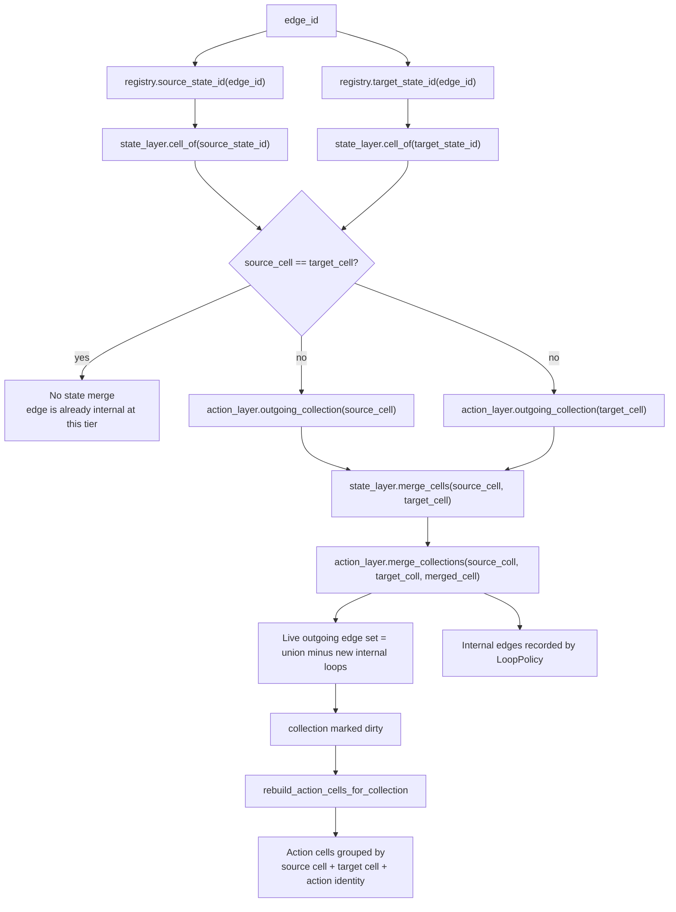

## Action-Side Table Meaning

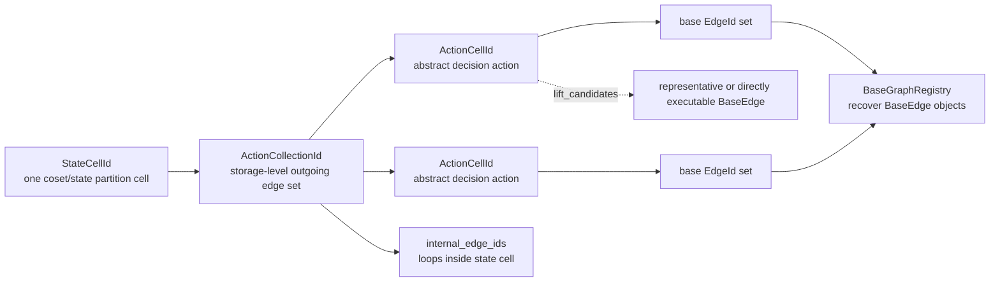

## Compatibility Quotient Readouts

`PartitionTower` is the source of truth. `QuotientTierView` objects are derived
compatibility readouts for older callers and tests.

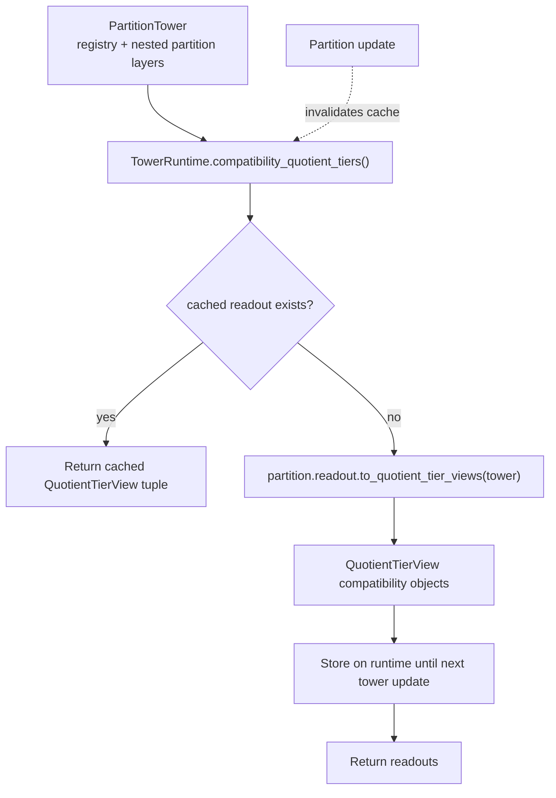

## Snapshot And Training Input Flow

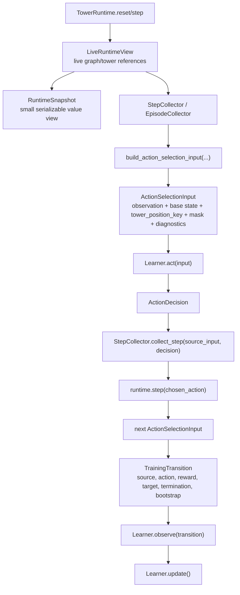

## Reference Online Training Loop

```mermaid
sequenceDiagram
    participant Loop as run_reference_online_loop
    participant Collector as StepCollector
    participant Runtime
    participant Learner
    participant Metrics as TrainingMetrics

    Loop->>Collector: reset_episode(seed)
    Collector->>Runtime: reset(seed)
    Runtime-->>Collector: reset result + LiveRuntimeView
    Collector-->>Loop: ActionSelectionInput

    loop up to max_steps_per_episode
        Loop->>Learner: act(current_input, mode="train")
        Learner-->>Loop: ActionDecision
        Loop->>Collector: collect_step(current_input, decision)
        Collector->>Runtime: step(chosen_action)
        Runtime-->>Collector: step result + LiveRuntimeView
        Collector-->>Loop: CollectedStep + TrainingTransition
        Loop->>Learner: observe(transition)
        Loop->>Learner: update()
        alt terminated or truncated
            Loop->>Loop: break episode
        end
    end

    Loop->>Metrics: on_episode_end(EpisodeMetrics)
    Loop-->>Caller: ReferenceLoopResult
```

## Example Environment Runtime Pattern

The example packages follow a repeated shape:

```text
env.py      domain environment, state, transition, rewards
runtime.py  HiddenGraph adapter + TowerRuntime binding
training.py small reference/tabular loops
```

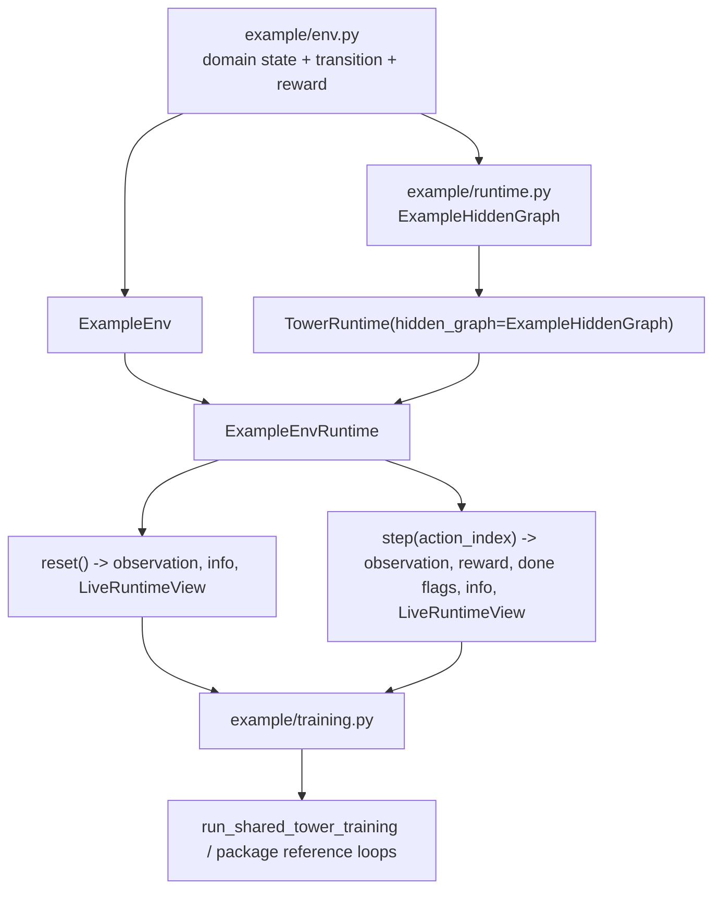

## Plate Support Example Flow

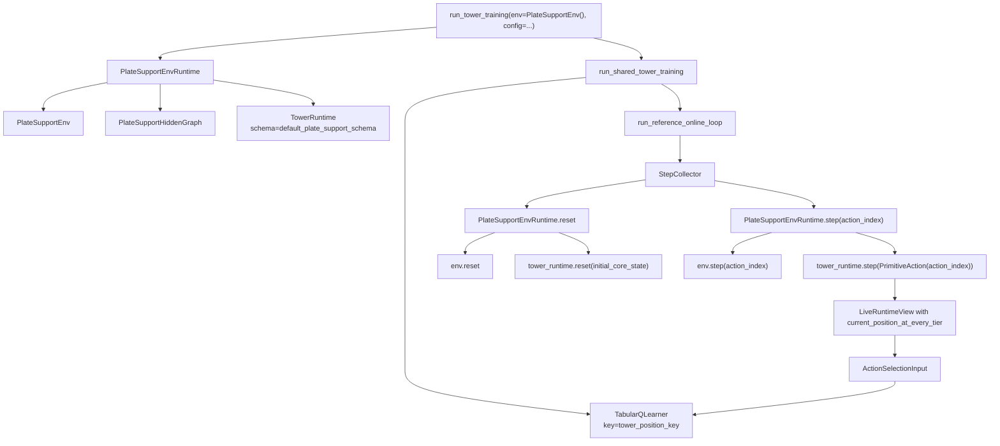

## Exploit / Explore Active-Tier Runtime

This path is separate from the simpler reference loops. It demonstrates
single-active-tier control and freeze/lift machinery with small tabular
components.

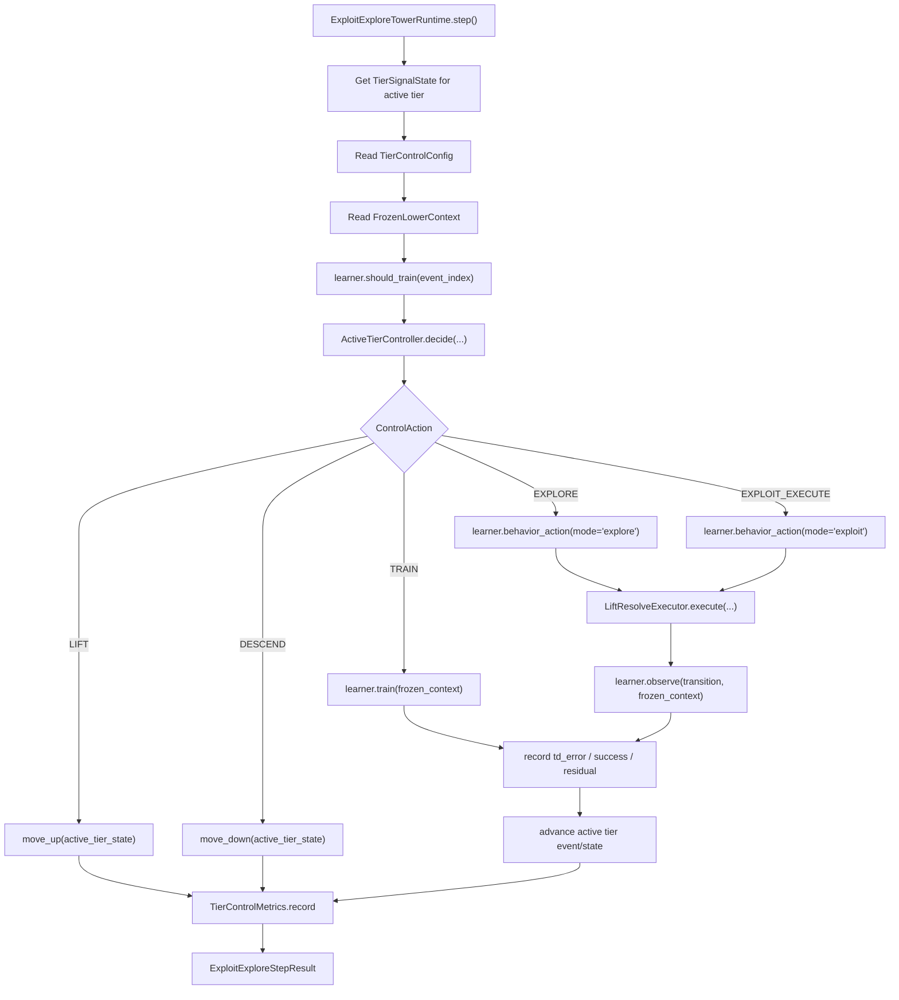

## Fiber-Conditioned Training Stage

This is the package-native surface for the "freeze tier i+1, train/lift at tier
i" idea.

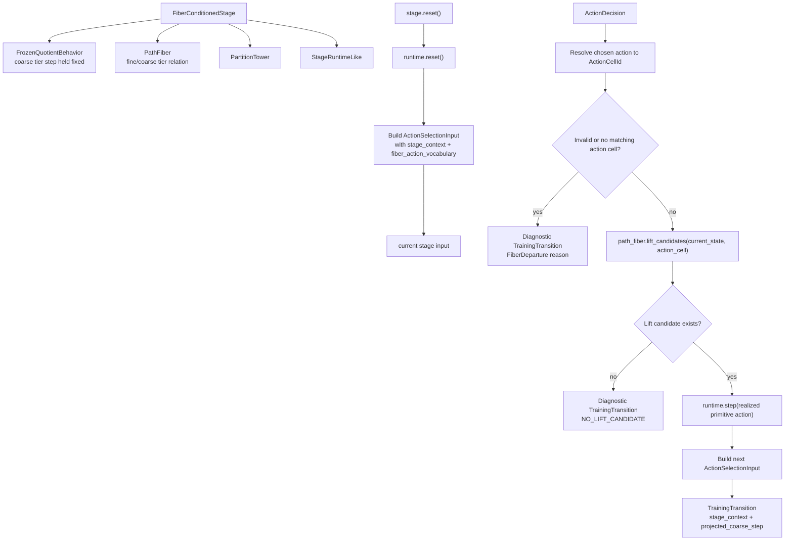

## Tensorization Boundary

The tensorization path starts after semantic training objects already exist. It
does not sit inside `TowerRuntime.step`.

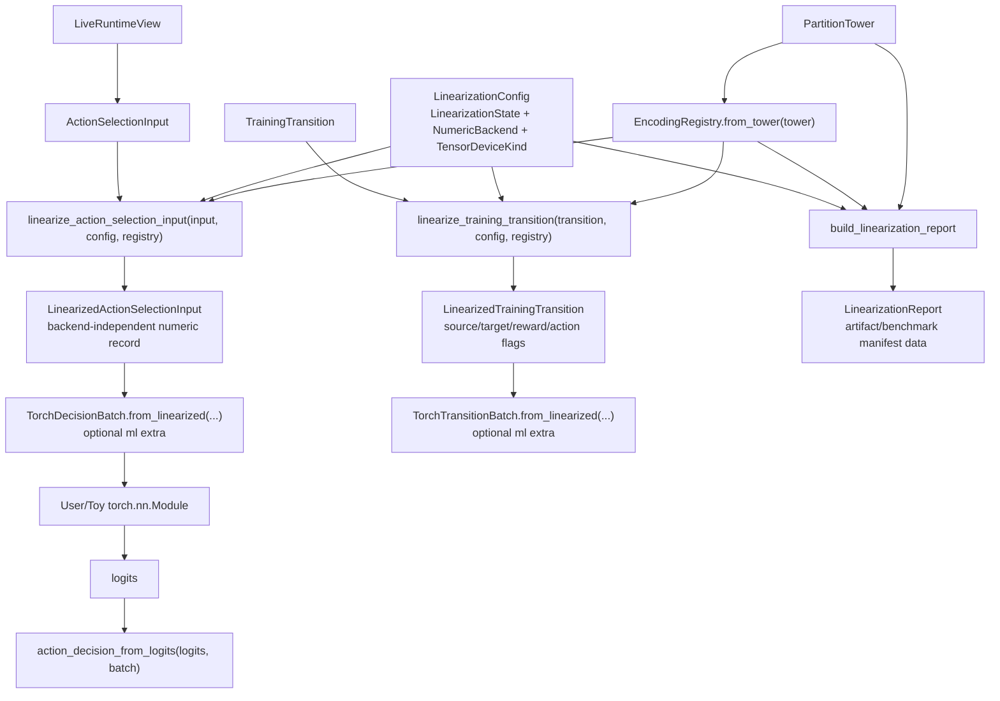

## Linearization Mode Logic

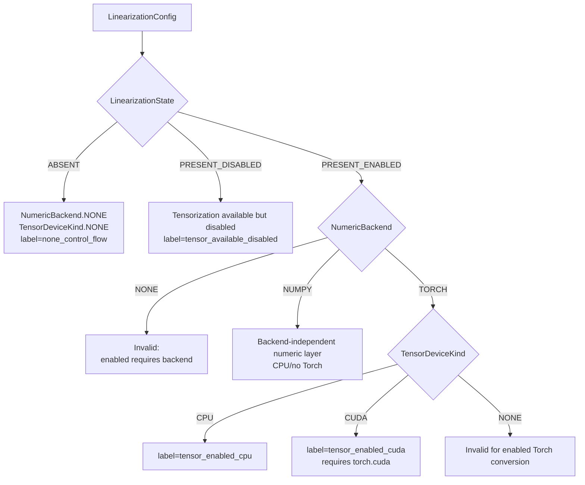

## Gymnasium Wrapper Flow

The Gymnasium wrapper is observation-only. It delegates to the env and records
realized transitions. It does not build a hidden graph or own a training loop.

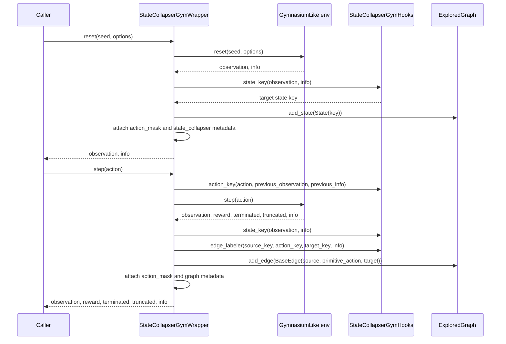

## Benchmark Flow

```mermaid
flowchart TD
    CLI["python -m state_collapser.benchmarks.tower_runtime_bench"] --> Args["parse_args<br/>steps / seed / mode / readout / morphism"]
    Args --> Probe["SUPPORTED_ENVIRONMENTS['plate_support_env']"]
    Probe --> RuntimeFactory["runtime_factory(policy, schema)"]
    RuntimeFactory --> Runtime["PlateSupportEnvRuntime + TowerRuntime"]
    Runtime --> BuildMorphism["Set tower_runtime._build_morphism flag"]
    BuildMorphism --> Reset["runtime.reset(seed)"]
    Reset --> MaybeReadout{"readout_requested?"}
    MaybeReadout -- yes --> Readout["tower_runtime.compatibility_quotient_tiers()"]
    MaybeReadout -- no --> Loop
    Readout --> Loop["For each benchmark step"]
    Loop --> RandomAction["rng.randrange(action_count)"]
    RandomAction --> Step["runtime.step(action)"]
    Step --> MaybeReadout2{"readout_requested?"}
    MaybeReadout2 -- yes --> Readout2["compatibility_quotient_tiers()"]
    MaybeReadout2 -- no --> More{"More steps?"}
    Readout2 --> More
    More -- yes --> Loop
    More -- no --> Metrics["discovered states/edges + tower depth + ops/sec"]
    Metrics --> Result["TowerRuntimeBenchResult.summary_line()"]
```

## HGraphML / Downstream Graph-Dataflow Path

The downstream graph-ML use case treats a graph as already discovered. It does
not need RL records or Torch batches for first-pass compatibility.

```mermaid
flowchart TD
    HGraph["Known graph / TensorGraph / graph-message-passing substrate"] --> Adapter["HGraphML state_collapser adapter"]
    Adapter --> StatesEdges["Convert graph nodes/edges to State/BaseEdge"]
    StatesEdges --> FullBuild["build_partition_tower_full(states, edges, current_state=None, schema)"]
    FullBuild --> Tower["PartitionTower"]
    Tower --> Fibers["Read node fibers and edge fibers by tier"]
    Tower --> Registry["EncodingRegistry.from_tower(tower)"]
    Registry --> StableIds["Stable numeric ids for nodes, edges, cells, tiers"]
    StableIds --> MessagePassing["Coarse message passing / lift over fibers"]

    BadPath["Do NOT fake RL ActionSelectionInput"] -. "category error" .-> MessagePassing
    Torch["Do NOT require Torch for this path"] -. "optional only" .-> MessagePassing
```

## Data Object Lifecycle

```mermaid
flowchart LR
    DomainState["Domain state<br/>example env"] --> State["core.State"]
    DomainAction["Domain action index/object"] --> PrimitiveAction["core.PrimitiveAction"]
    State --> BaseEdge["core.BaseEdge"]
    PrimitiveAction --> BaseEdge

    BaseEdge --> Registry["BaseGraphRegistry ids"]
    Registry --> StateLayer["StatePartitionLayer cells"]
    Registry --> ActionLayer["ActionPartitionLayer collections/cells"]
    StateLayer --> RuntimePosition["current_position_at_every_tier"]
    ActionLayer --> AbstractActions["ActionCellId abstract actions"]

    RuntimePosition --> LiveView["LiveRuntimeView"]
    AbstractActions --> LiveView
    LiveView --> ActionInput["ActionSelectionInput"]
    ActionInput --> Decision["ActionDecision"]
    Decision --> TrainingTransition["TrainingTransition"]
    TrainingTransition --> Linearized["LinearizedTrainingTransition"]
    Linearized --> TorchBatch["Optional TorchTransitionBatch"]
```

## What Changes During Exploration

```mermaid
flowchart TD
    Before["Before step:<br/>registry + partition layers"] --> Realized["Realized primitive transition"]
    Realized --> ExploredDelta["ExploredGraph adds edge/path state"]
    ExploredDelta --> VistaDelta["VistaGraph refreshes local outgoing edges"]
    VistaDelta --> VisibleDelta["Visible states/edges for current/refreshed states"]
    VisibleDelta --> RegistryDelta["BaseGraphRegistry registers only new states/edges"]
    RegistryDelta --> LayerDelta["PartitionTower updates only affected layers/cells"]
    LayerDelta --> Result["TowerUpdateResult"]
    Result --> RuntimeFields["Runtime updates positions, selected edges, diagnostics"]
    RuntimeFields --> After["After step:<br/>same base registry plus coarser partition updates"]
```

## What Does Not Happen

```mermaid
flowchart TD
    No1["TowerRuntime.step"] -. "does not" .-> FullRebuild["rebuild whole quotient tower from scratch each step"]
    No2["PartitionTower"] -. "does not" .-> CopyGraph["copy base graph into every quotient tier"]
    No3["training.linearization"] -. "does not" .-> OwnModel["own model architecture / optimizer / replay"]
    No4["training.torch"] -. "does not" .-> ImportTorchCore["make Torch a core dependency"]
    No5["Gymnasium wrapper"] -. "does not" .-> InferHidden["infer hidden graph or replace Gymnasium loop"]
    No6["HGraphML path"] -. "does not" .-> FakeRL["force graph dataflow through RL ActionSelectionInput"]
```

## Current System Summary

```mermaid
flowchart TD
    A["Environment or known graph"] --> B["Core State / PrimitiveAction / BaseEdge"]
    B --> C["HiddenGraph, ExploredGraph, VistaGraph"]
    C --> D["TowerRuntime"]
    D --> E["PartitionTower<br/>registry + nested state/action partitions"]
    E --> F["LiveRuntimeView"]
    F --> G["Training surfaces<br/>ActionSelectionInput / TrainingTransition"]
    G --> H["User learner or reference tabular learner"]
    G --> I["Optional linearization"]
    I --> J["Optional Torch"]
    E --> K["Compatibility readouts"]
    E --> L["HGraphML shared encoding path"]
    D --> M["Benchmark smoke tooling"]
```

The center of the package is therefore:

```text
discovered graph
    -> persistent partition tower
        -> runtime snapshots
            -> training, tensorization, benchmark, and downstream graph-dataflow surfaces
```

